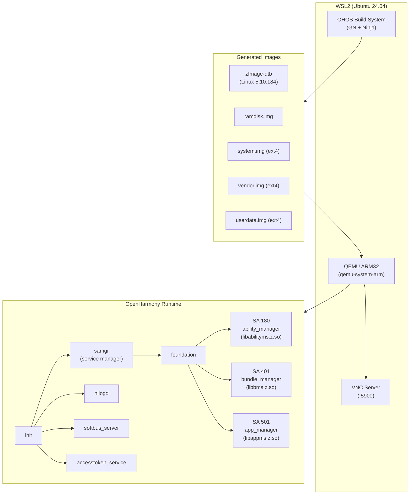

# OpenHarmony on WSL2 with QEMU

[]()
[]()
[-orange)]()
[]()

Build, boot, and develop for OpenHarmony without real hardware. This repository provides a complete pipeline for compiling OpenHarmony from source on WSL2 and running it under QEMU ARM32 emulation with full system service support.

```
┌─────────────────────────────────────────────────────┐
│  Windows 11 Host                                    │
│  ┌───────────────────────────────────────────────┐  │
│  │  WSL2 (Ubuntu 24.04)                          │  │
│  │  ┌─────────────────────────────────────────┐  │  │
│  │  │  QEMU ARM32 (qemu-system-arm)           │  │  │
│  │  │  ┌───────────────────────────────────┐  │  │  │
│  │  │  │  OpenHarmony Kernel (5.10.184)     │  │  │  │
│  │  │  │  ┌─────────────────────────────┐  │  │  │  │
│  │  │  │  │  init → samgr → foundation  │  │  │  │  │
│  │  │  │  │  SA 180: ability_manager    │  │  │  │  │
│  │  │  │  │  SA 401: bundle_manager     │  │  │  │  │
│  │  │  │  │  SA 501: app_manager        │  │  │  │  │
│  │  │  │  │  + 12 system services       │  │  │  │  │
│  │  │  │  └─────────────────────────────┘  │  │  │  │
│  │  │  └───────────────────────────────────┘  │  │  │
│  │  └─────────────────────────────────────────┘  │  │
│  └───────────────────────────────────────────────┘  │
└─────────────────────────────────────────────────────┘
```

---

## Key Achievements

| Metric | Value |
|--------|-------|
| Build targets compiled | 4,757 / 4,851 (98%) |
| System libraries | 466 shared libraries |
| Running services | 12+ (samgr, foundation, hilogd, accesstoken, etc.) |
| System abilities | SA 180, 401, 501 (ability, bundle, app manager) |
| Source patches applied | 70+ (GN clobbering, SUPPORT_GRAPHICS guards, LTO fixes) |
| Boot stability | Stable, no crashes, clean shutdown |
| Failed targets | 1 (libui_extension.z.so -- UI-only, not needed for headless) |

---

## Prerequisites

| Requirement | Minimum | Recommended |
|-------------|---------|-------------|
| OS | Windows 10 21H2+ with WSL2 | Windows 11 |
| WSL2 distro | Ubuntu 22.04 | Ubuntu 24.04 |
| RAM | 16 GB | 32 GB |
| Disk space | 150 GB free | 250 GB free |
| CPU cores | 4 | 8+ |
| QEMU | 7.2+ | Provided in `tools/qemu-extracted/` |

```bash
# Verify WSL2
wsl --version
# Ensure Ubuntu 24.04
lsb_release -a

# Required packages
sudo apt update && sudo apt install -y \
  build-essential git python3 python3-pip \
  repo curl wget unzip libncurses5 \
  qemu-system-arm device-tree-compiler
```

---

## Quick Start

```bash
# 1. Clone
git clone https://github.com/A2OH/openharmony-wsl.git
cd openharmony-wsl

# 2. Download OHOS source (or use pre-built images)
./scripts/fetch-ohos-source.sh

# 3. Build (headless ARM32 target)
./scripts/build-ohos.sh qemu-arm-linux-headless

# 4. Generate ext4 images
./scripts/prepare_images.sh

# 5. Boot QEMU
./tools/qemu_boot.sh
```

After boot, you will see the OHOS shell. Foundation services start automatically.

---

## Architecture



---

## Build Instructions

### Full Build from Source

```bash
# Set up OHOS build environment
source build/envsetup.sh

# Configure for headless ARM32 QEMU target
./build.sh --product-name qemu-arm-linux-headless --ccache

# This builds 4,757 targets including:
# - Linux kernel 5.10.184 with OHOS patches
# - 466 system shared libraries
# - Foundation framework (samgr, ability manager, bundle manager)
# - System services (hilog, softbus, accesstoken, device_manager)
```

### Image Generation

```bash
# Generate ext4 filesystem images from build output
./scripts/prepare_images.sh

# Output:
#   out/qemu-arm/images/zImage-dtb
#   out/qemu-arm/images/ramdisk.img
#   out/qemu-arm/images/system.img
#   out/qemu-arm/images/vendor.img
#   out/qemu-arm/images/userdata.img
```

### Debugfs File Injection

Inject files into ext4 images without re-building:

```bash
# Inject a binary into system.img
debugfs -w out/qemu-arm/images/system.img \
  -R "write /path/to/local/file /target/path/in/image"

# Useful for deploying test binaries (e.g., dalvikvm) without full rebuild
```

---

## QEMU Boot Options

### Headless (Serial Console)

```bash
./tools/qemu_boot.sh --serial
# or manually:
qemu-system-arm \
  -M virt \
  -cpu cortex-a15 \
  -m 2048 \
  -kernel out/qemu-arm/images/zImage-dtb \
  -initrd out/qemu-arm/images/ramdisk.img \
  -drive file=out/qemu-arm/images/system.img,format=raw,if=virtio \
  -drive file=out/qemu-arm/images/vendor.img,format=raw,if=virtio \
  -drive file=out/qemu-arm/images/userdata.img,format=raw,if=virtio \
  -append "console=ttyAMA0" \
  -nographic
```

### VNC Display

```bash
./tools/qemu_boot.sh --vnc
# Connects to localhost:5900
# Use any VNC viewer (TigerVNC, RealVNC)
```

### Network Support

```bash
./tools/qemu_boot.sh --net
# Adds virtio-net device with user-mode networking
# Guest can access host network, download packages, etc.
```

---

## Available System Libraries

Key libraries confirmed present on the running system:

| Library | Purpose |
|---------|---------|
| `libhilog_ndk.z.so` | Logging framework |
| `libnative_rdb_ndk.z.so` | Relational database |
| `libnative_preferences.z.so` | Key-value preferences |
| `libace_napi.z.so` | ArkUI N-API bindings |
| `libabilityms.z.so` | Ability lifecycle management |
| `libbms.z.so` | HAP install/manage |
| `libappms.z.so` | App process management |
| `libwm.z.so` | Window manager |
| `libdm.z.so` | Display manager |
| `libace_xcomponent_controller.z.so` | XComponent control |

**Not available (headless, no GPU):**
- `libnative_drawing.so` (OH_Drawing -- requires GPU)
- `libnative_window.so` (NativeWindow -- requires display)

---

## What You Can Do

With this running OHOS system:

- **Install HAPs:** `bm install -p /path/to/app.hap`
- **Launch abilities:** `aa start -a MainAbility -b com.example.app`
- **Test IPC/binder:** Communicate between system abilities via samgr
- **Deploy native binaries:** Inject via debugfs, run on ARM32 OHOS
- **Develop OH system services:** Test without hardware in the QEMU loop
- **Cross-compile and test:** Build ARM32 binaries on x86_64, test immediately

---

## Known Issues

| Issue | Severity | Workaround |
|-------|----------|------------|
| `libui_extension.z.so` fails to build | Low | Not needed for headless. UI extension requires full graphics stack. |
| No GPU acceleration in QEMU | Medium | Software rendering only. OH_Drawing unavailable. Use headless testing. |
| First boot takes ~60s | Low | Subsequent boots faster with cached images. |
| Limited to ARM32 | Medium | ARM64 QEMU target planned. Current focus is on ARM32 for Dalvik VM compatibility. |
| 70+ source patches needed | Low | Patches documented in `patches/` directory. Upstream contributions planned. |

---

## Repository Structure

```
openharmony-wsl/
├── scripts/
│   ├── fetch-ohos-source.sh    # Download OHOS source tree
│   ├── build-ohos.sh           # Build for QEMU target
│   └── prepare_images.sh       # Generate ext4 images
├── tools/
│   ├── qemu_boot.sh            # Boot QEMU with various options
│   └── qemu-extracted/         # Pre-built QEMU binaries
├── patches/                    # 70+ source patches for headless build
├── configs/                    # Product and kernel configs
└── docs/                       # Build logs, troubleshooting
```

---

## Contributing

Contributions are welcome. Key areas where help is needed:

1. **ARM64 QEMU target** -- extend build to 64-bit ARM
2. **GPU passthrough** -- enable OH_Drawing in QEMU
3. **Automated CI** -- headless boot + smoke test in GitHub Actions
4. **Upstream patches** -- get the 70+ fixes accepted into OpenHarmony mainline

Please open an issue before starting work on major changes.

---

## License

Licensed under the Apache License, Version 2.0. See [LICENSE](LICENSE) for details.

OpenHarmony is a project of the OpenAtom Foundation. This repository is an independent community effort and is not officially affiliated with or endorsed by the OpenAtom Foundation.
